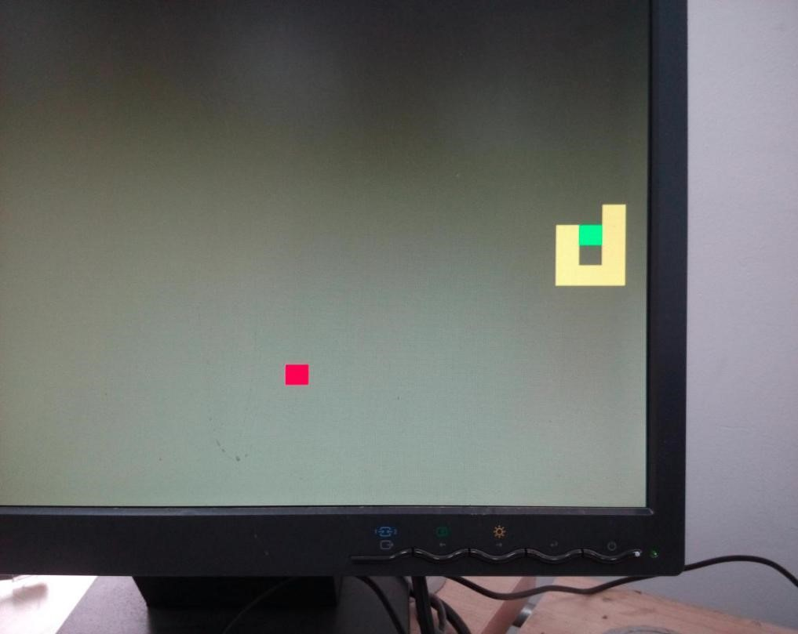

# FPGA-snake

A snake game implemented in Verilog, tested on Nexys 3 (Nexys 3 specific UCF file included).

## How to Play

1. Connect Nexys 3 to the VGA display
2. Move the left most switch to reset/start
3. Press those 4 direction buttons to change direction. Press the middle button to pause/resume
4. The score is displayed on the onboard LED

## Known Issues

- Due to race condition, The snake may stretch while the apple remains there if you change direction exactly when it is eating the apple.